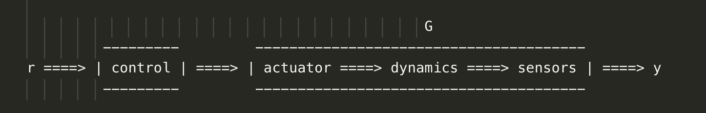
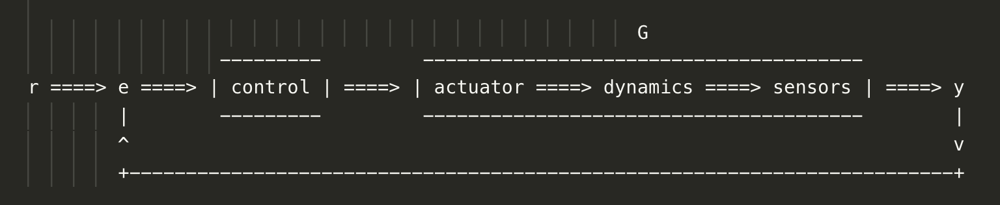

# Unit 2

## How Rockets Work

Propulsion:

- From latin pro => forward + pellere => to drive
- Propulsion system is a machine that produces **thrust** to push an object forward
- To move a rocket we carry a material (fluid) and we push it out to produce a movement forward. The fluid that we push put is called **working fluid**.
- In the case of a propeller plane the working fluid is the air
- In the case of a jet engine it takes in air from outside and uses fuel to create thrust
- A rocket differs from a jet engine as it doesn't take air in and has to carry its own oxidizer
- Oxidizer + Fuel = Propellants

## Solid Rocket Motors

- Started centuries ago by the Chinese
- You mix the fuel and the oxidizer together into the rocket, you leave a hole in the middle (combustion chamber) and you ignite it
- The largest ever made was the booster for the space shuttle
- In the space shuttle you have column of black solid material consisting of fuel+oxidizer with a hole in the middle - the combustion chamber
- PRO: It's simple as it has no moving parts and only the flame moving through the combustion chamber
- CONS: Can't be turned off once ignited (can be controlled a bit)
- There is an Hybrid Rocket Motors where the column is made of fuel only and the oxidizer is poured into the combustion chamber to start ignition
- Currently can't build large Hybrid Rockets

## Liquid Rockets

- 20th century invention
- The fuel and the oxidizer are stored in tanks
- They are poured into the combustion chamber via a pipe where they are ignited
- Hot gast comes out back and creates thrust for the rocket to move forward
- Fuel and oxidizer are injected into the combustion chamber passing through a shower head where they get pre-mixed to facilitate ignition
- As the pression goes up you need a way to move the fuel and the oxidizer from their tanks to the combustion chamber => Turbo Pumps!
- The oxigen pump for the space shuttle main engine was pushing out at 50k horse power
- Why the nozzle and its shape?
  1. you don't want to consume all propellants at once
  2. the coverging - diverging shape with a thin throat in the middle allows the randomly moving molecules motion to be turned into a directed kinetic energy (in poor words molecules that were moving randomly pass through the throat and change direction moving towards the end of the nozzle with a direct trajectory with almost no side motion)

## The Ideal Rocket Equation

How much energy does it take to get 1kg to orbit?
¹²³⁴⁵⁶⁷⁸⁹⁰

- You need potential energy to move 1kg to the orbit
- Potential energy = `m*g*h` - `1kg * 9.8 m/s² * 400.000m` = `3.92 * 10⁶ Joules`
- You need kinetic energy to stay in orbit and don't fall down
- Kinetic energy = `1/2 mv²` = `0.5 * 1kg * (8 * 10³ m/s)²` = `3.2 * 10⁷ Joules`
- Potential + Kinetic = `3.6 * 10⁷ Joules` = `10 kilowatt/hrs` = `$1`
- If we could put energy directly into the 1kg it's extremely inexpensive to move it to orbit
- Actual cost ranges between 10k-20k\$ per kilo

How much performance can you get with the limited amount of propellant you can carry on board?

Working out the math it all depends on the exhaust velocity (the velocity at which the propellant is thrust out of the rocket).

### Effect of exhaust velocity on achieving earth orbit

- `Ve`: exhaust velocity
- `mi`: initial mass (payload + propellant + structure)
- `mf`: final mass (payload + structure)
- `mprop`: propellant mass

- Given a `Ve` of `2000 m/s` we get a ratio between `mf/mi` of `0.011` and consecutively `mprop/mi` is `0.99`. This means that if we want to bring a rocket into the eart orbit with an exhaust velocity of `2000 m/s`, 99% of the rocket initial total mass must be propellant
- Given a `Ve` of `4000 m/s` (double the above) => `mf/mi = 0.105` and `mprop/mi = 0.89`. This means that doubling the exhaust velocity we get an exponentially better result as now only 89% of the rocket must be propellant (compared to 99%): double exhaust velocity => 10% more space on the rocket

## Rocket Staging

- The Rocket Equation dictates how much mass we can dedicated to the payload and to the structure of the rocket.
- We need a structure as light as possible: this brings the problem that lighter structures deform more easily (see Mercury Atlas 2: had an aluminium skin so thin that had to be constantly pressureized)
- We need an exhaust velocity as high as possible: this brings the problem that the combustion chamber metals can't stand the high temperatures and pressures

## The Effects of Gravity and Atmospheric Drag

### Dynamic Pressure

After breaking the sound barrier (Mach 1) the rocket is subject to a lot of vibrations. This is because of **dynamic pressure**: the pressure that a vehicles feels flying through the atmosphere depends on the thickness of the atmosphere and the velocity.

`q = 1/2 * p * v²`

- `q`: dynamic pressure
- `p`: thickness of the atmosphere
- `v`: velocity

`q` over time has a bell curve shape, going up and then going down. `p` keeps decreasing, `v` keeps increasing and it does so faster than `p` can decrease, causing `q` to go higher and higher. At a certain point they switch and `p` starts decreasing faster than `v` can increase, causing `q` to go down.

### Thrust

- When taking off in gravity field the **exhaust velocity** is important but not the only thing. If you were to launch a rocket weighing 100.000kg with a thrust of 90.000kg, the rocket wouldn't move
- the **thrust to weight ratio** is the other important variable: how much more thrust do you have than the weight of the vehicle? If it's >1 then the rocket will take off

## Other types of propulsion systems

### Nuclear Thermal Rocket Engine

- Similar to a chemical rocket (Solid, Hybrid, Liquid rockets) as it has a fuel tank
- We feed the fuel (usually liquid hidrogen) to the reactor code that heats up the fuel and the result goes through the nozzle cauising thrust
- We currently don't fly these type of rockets, but research has shown they would allow us to get about twice **exhaust velocity**

### Electric Propulsion

- Take a gas (usually a heavy gas like xenon, easy to ionize), strip some electrons off the gas atoms (which make them electrically charged) and put them in a electric field to accelerate them
- There are different types of electric engins, but the common base is:
  - Ionize atoms (so that the atoms have an electrical charge)
  - Accelerate the atoms in an electrical field
  - Use a system to focus the beam to create thrust (usually a magnetic field)
- High Exhaust Velocity - Low Thrust

### Exhaust Velocity

- Chemical propellants: 2/4.5 km/s
- Nuclear fission: up to 9/10 km/s
- Electric engines: 20/30 up to 50 km/s

**Electric propulsion is times and times more efficient.**

So, why don't use it more?
Electric Propulsion only works in free space (no vacuum, no gravity), so:

- can't take off from earth as it's not in a vacuum
- can't take off from the moon (which is in a vacuum) becuase of gravity

Therefore it's used in interplanetary travel.

## Control Theory

- Elements of a control system are **Sensors** and **Actuators** (in a car analogy the sensors would be the eyes and the actuator would be the steering wheel)
- In a rocket you have accelerometers, gyroscopes and the control system
- In the space shuttle there are 2 types of actuators: the **aerodynamic actuators** (elevons and tail rudder) and the **rocket engines** (control directions). Both controlled by hidraulic systems.

You can represent a control system as an **open loop** or as a **closed loop**.

### Open Loop

- `r`: what we want to achieve
- `control`: our control system
- `G`:
  - `actuator`: what you can use to move
  - `dynamics`: all the things that affect your vehicle
  - `sensors`: give us measurements
- `y`: the outcome

In the open loop we want `r` to equal `y` so we need `control` to be the inverse of `G` (`control = 10, G = 1/10, G*G/10 = 1 => r = y`)

This system as good as it is on paper doesn't work well in reality

### Closed Loop

Similar to the Closed Loop except that we get the output `y` (which usually never is like `r`), we identify the difference between `r` and `y` (`e`) and we feed that back into our system.

If we had it all figured out, the open loop would be our better choice, but in case of errors the closed loop is the best option as it offers higher **robustness** and **sensitivity**.

## PID Controllers

~95% of controllers in the world are PID

There are 3 types of controller forms:

- **Proportional Feedback**: if `e` is not 0 (hence `r !== y`) our controller needs to act on `G` (`Kp`)
- **Derivative Feedback**: it does "anticipation of future errors". Gives feedback on the overall trend of `e` so that it can anticipate where it's going to go next (`Ki`)
- **Integral Feedback**: it's used to reduce "steady-state error". When `e` is closed to 0 it could be fine for the short time, but over the long time a small error can become very large. Integral Feedback aims to avoid that. (`Kd`)

## Structural Engineering

When creating a new structure you want to:

- identify loads that the structure will experience
- determine the suitable arrangment of the structural elements
- select materials and dimensions
- define fabrication and assembly process
- monitor structure over time (maintenance)

Requirements:

- satisfy design criteria
- maintain **structural integrity** (_strength_ under heaviest loads, _stifness_ during deformation, _longevity_ until project completion)
- optimize costs (fabrication and operational)

## Common Aerospace Structural Materials

- Aluminum: more expensive than steel; tends to fracture (solved by material scientists)
- Steel
- Composite Materials: developed in the last few decades; take long time to develop
- Titanium: very expensive but very strong structurally

Need for materials that work well under high temperatures. Problem with the elements above is that as the temperature goes up their structural strength decays.

- Nickel superalloys

### Properties

- Elasticity
- Plasticity
- Fracture
