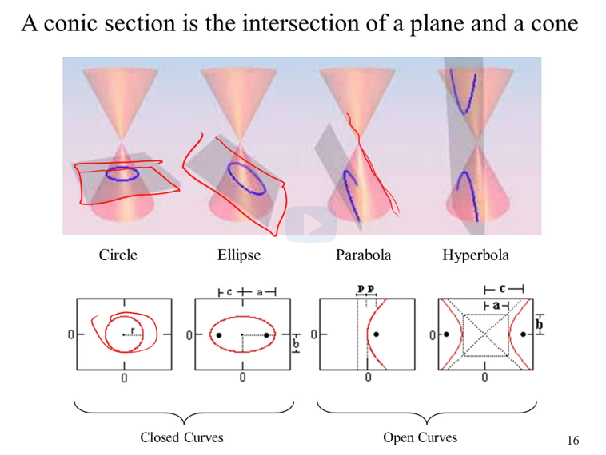
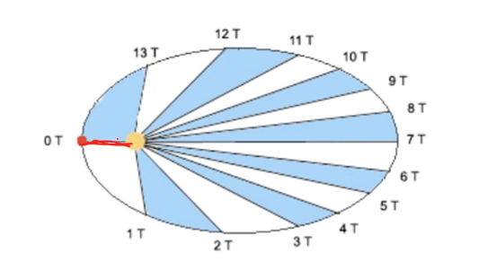
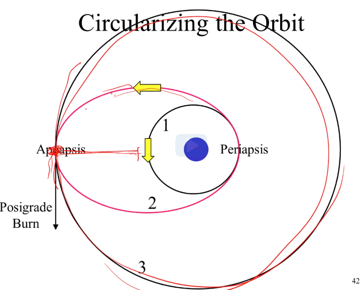

# Unit 4

## Circular Orbits

- simple orbital motion: an object going around a second object. The motion is elliptic
- the force between two objects is inversed square: if you move the 2 objects at twice the distant, the gravitational force drops to a quarter
- in the formula we use the **Netwon's gravitational constant** which we believe is constant throughout the whole universe
- _the velocity at which the second object moves around the orbit does **not** depend on the second object mass, it only depends on the first object mass_
- the above deduction means that any object at a given distance moves at the same velocity. This is particularly important with the ISS: we can send ships that are much smaller than the station and they will move at the same velocity, given they are at the same distance from earth
- as the second object gets farther away from the first object, its **orbital velocity** decreases. Consequently the **orbital period** increases
- the distance at which the rotation period equals 24hrs is **42.240km**. This is particularly important for satelitte as they need to be moving over the same point on earth all the time
- the orbit on which the period is 24hrs, is called the **Geostationary Orbit**

## Some formulas

Given 2 objects `M1` and `M2`:

```
Fgrav = (G * M1 * M2) / R2
Fgrav / M2 = (G * M1) / R1
acceleration = Vcˆ2 / R (Vc = velocity)
Vcˆ2 = (G * M1) / R
Period = 2πR / Vc
Periodˆ2 = (4 * πˆ2 * Rˆ3) / (G * M1)
```

## Kepler's Laws

### First Law

If two bodies interact gravitationally, each will describe an orbit that is a **conic section\***. If the bodies are permanently associated the their orbits are **ellipses**, otherwise they are **hyperbolas** (open curves).

- The conic section is the intersection between a plane and a cone. There are 4 possible combinations:

* when the plane is parallel to the base of the cone: the conic section will be a circle
* when the plane is not intersecting the base: the conic section will be a ellipse
* when the plane is itersecting the base (not vertically): the conic section will be a parabola
* when the plan is perpendicular to the base: we have an hyperbola

Circle and ellipse are closed curves (permanent orbits). Parabola and hyperbola are open curves (temporary orbit)


### Second Law

Planets move at variable speed around the orbit. Tracing lines between the central body and the orbit at equal periods of time, the areas resulting are all equal. It means that objects closer to the central body move faster than when they are far away.


### Third Law

The square of the period of a planet's orbit is proportional to the cube of the semi-major axis of the orbit.

## Orbital Energy and Escape Velocity

Orbital Energy is negative in closed orbits and positive in opened orbits.

For orbits with same major axis but different eccentricities, the orbital energy stays the same.

The escape velocity of an object is: `escapeV / orbitalV = √2`

## Orbital Mechanic

To change orbit there are 2 types of burn:

1. **Posigrade**: increases velocity bringing you on a bigger orbit
2. **Retrograde**: decreases velocity bringing you on a smaller orbit

To go back from orbit to earth you use a retrograde brun that brings you into the atmosphere and from there the atmosphere takes care of the rest (deceleration and brining you to earth).

**Periapsis**: the point on the orbit closest to the central object. **Apoapsis** is the furthest point on the orbit.

To change from one circular orbit to the other you need 2 burns:

1. the first burn brings you on a new elliptical orbit, starting from the Periapsis/Apoapsis (depending on the type of burn).
2. when you reach the other extreme, you need to perform another burn to get into the new circular orbit
   

## Change orbital inclination

If you want to change the inclination of your orbit compared to the equator's plane, the formula is `ΔV = V * sin(Δi)`.

For a change of `Δi = 1°` you need a `ΔV = 135 m/s`. Considering that the shuttle carries 10.000kg of propellant for a total ΔV of ~300 m/s, even a change of 1° is a big expense.

## Orbital Rendezvous

The action of meeting up with an object which is already in orbit.


