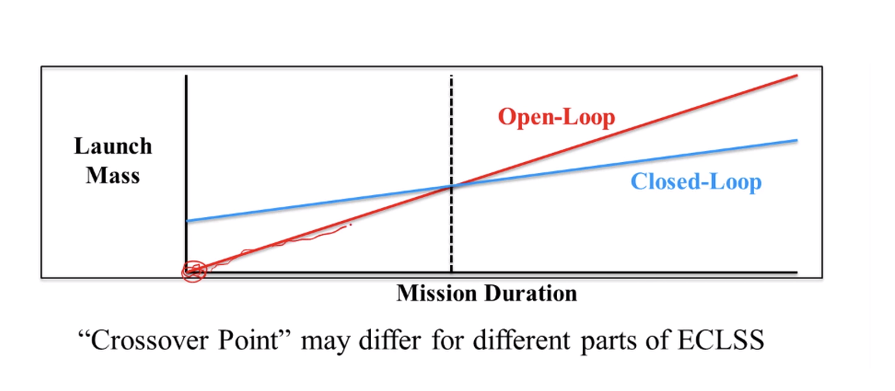
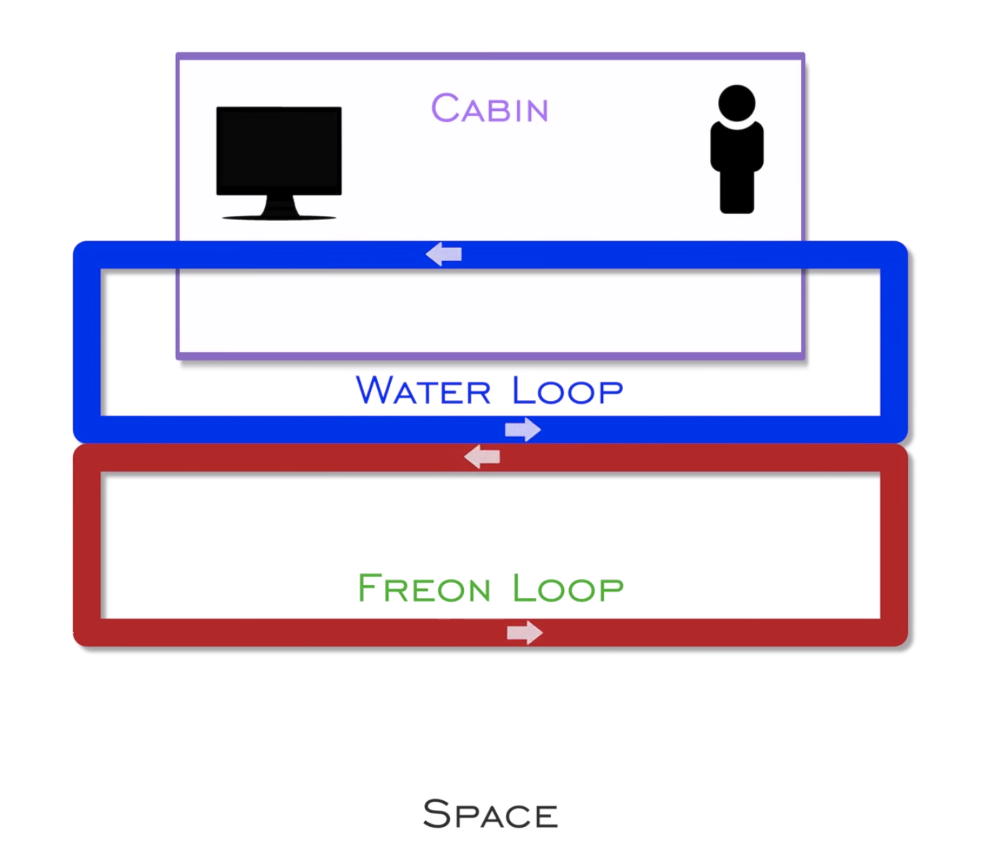
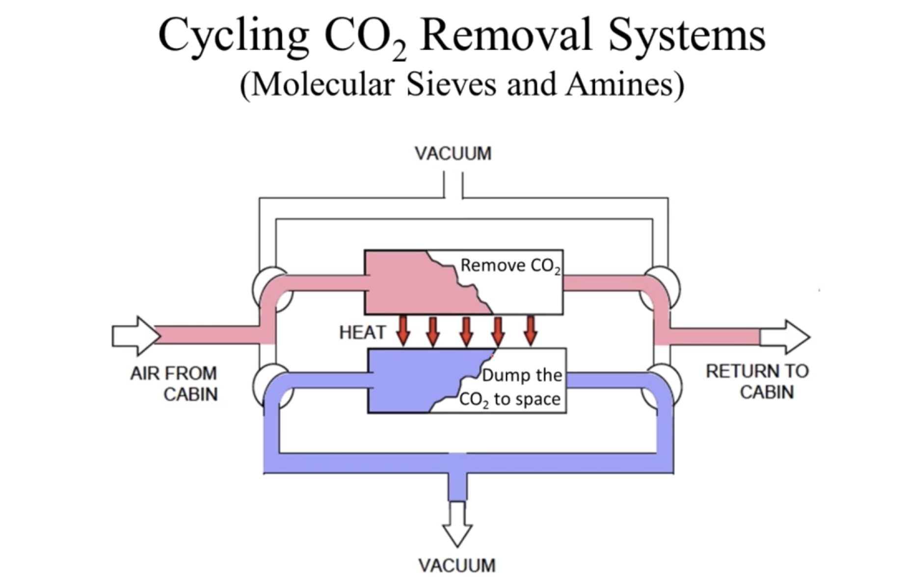
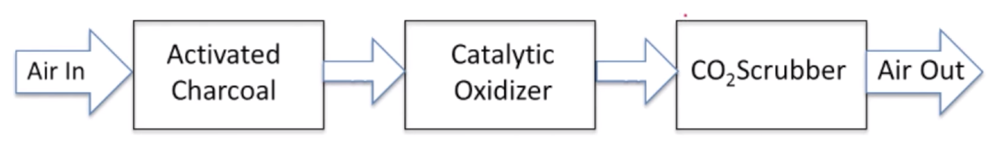

# Unit 3

## ECLSS - Environmental Control and Life Support Systems

Humans in space needs:

- Oxygen
- Atmospheric pressure
- Clean atmosphere
- Controlled temperature and humidity
- Water and food
- Waste disposal
- Control microbes

The environment containing the above is not available in space and needs to be created. Hence ECLSS.

The ECLSS System needs to be:

- reliable
- maintainable
- sustainable
- affordable
- minimum impact (constraints are: mass, power, volume, crew time)

Based on different types of missions, there are different requirements for the ECLSS.

**Open Loop Mode**: All resources are brought from earth. Once the resources become waste, they are disposed of. No recycling.

**Closed Loop Mode**: Waste products are recycled so that they can be reused.

Most systems are partially open and partially closed. Some resources are one, others are the other.

The **open loop** line starts from 0 and goes up linearly and quite steeply (in a mission of 1 day you barely need any resource but at *times the duration you need *times the resources).

The **closed loop** has an higher initial cost even for very short missions due to equipment that helps with recycling. But as the mission duration increases, the amount of resources doesn't increase as steeply as in the open loop (2\*duration does not require 2\*resources), thanks to recycling.

## Food and Personal Hygiene

- no shower: there was an attempt but the effort to make it work didn't not make it worth
- no clothes washing: once dirty they get disposed to in space
- food is MRE - meals ready to eat: it's real food, thermo- and radiation-stabilized to increase the shelf life. MRE is quite good compared to old dehydrated food packages

## Temperature and Humidity control

- humans have a narrow range of humidity and temperature where they feel comfortable => need a way to reduce humidity and keeps temp stable
- getting cold is not a problem as it's cold out in space
- getting warm can be a problem as the crew and the electronics produce heat

To reduce the temp in the cabin the space shuttle uses a "2 fluids heat system". The 2 fluids are water and freon (as freon is highly dangerous we can't use it directly in the cabin in case there is any leak, hence the 2 fluids system).

Cold water goes in a loop inside the cabin, cooling it down. On the outside of the cabin, the freon goes in a loop, very close to the water, allowing the water to pass the heat to the freon

In the ISS ammonia is used instead of freon. Water can't be used alone as it freezes.

## Atmospheric Pressure and Composition

- need to provide pressure otherwise our bodies would swell up as liquids inside our body vaporize
- need enough oxygen to breathe
- as the pressure goes down you need to provide more oxygen (think hiking in high altitudes) until you reach such a low pressure where you need air with 100% oxygen to be able to brethe properly. Can't lower the pressure anymore as you won't have enough oxygen
- the lack of oxygen is called **hypoxia**. The crew does training in case something goes wrong with the sensor in the cabin so that they can recognise the signs of hypoxia and act before they lose consciousness. The training consists in putting the test subjects in altitude chambers with oxygen masks, pump the atmosphere down, make them remove the mask and observe their body reaction so that they can recognize them again if something similar happens. Symptoms of hhypoxia are:
  - blue lips and fingernails
  - memory loss
  - shaking
  - vision degradation
  - loss of consciousness (quite dangerous as just before losing it you get a feeling of weel being and euphoria)
- based on the fact that you can regulate pressure and oxygen level, you can get away with having a combination of low pressure + high % of oxygen or higher pressure + lower % of oxygen
- lower pressure also means you can use a lighter structure for your spacecraft
- but low pressure means higher oxygen % (up to pure oxygen) and this impy higher danger of fire
- spacesuits offer low pressure with pure oxygen atmosphere to improve mobility inside it

## Oxygen Supply

For short period of times:

- bring it up in high pressure canisters

For longer missions (months):

- liquify it and cool it off (cryogenic method)

For longer period of times:

- **chlorate candles** to generate oxygen during combustion
- **electrolysis** (produce hidrogen and oxygen by sending electricity through water)

Electrolysis is fairly complicated in space as the bubbles of oxygen don't rise and gases don't separate from liquids. A centrifuge is used to make the separation.

The **Oxygen Regeneration System** is made - among other things - of the:

- electrolysis stack (see above)
- deionizer bed: to make sure ions don't go into the water, wich would poison the electrolysis system
- N₂ purge: to take all the oxygen out of the tubes once the system is stopped (pure oxygen is a fire hazard)

## Carbon Dioxide Removal

When breathing we take ~21% of oxygen in and breathe out ~5% of CO₂. Breathing out we release a lot of oxygen (~15%) and we don't want to lose it. Hence the Carbon Dioxide Removal (aka Scrubbing)

Interesting fact: as the air has no weight in space stations, it doesn't flow and mix like it would on earth so you need to constantly move it around with fans to avoid having areas without oxygen. Still, sometimes some air pockets with a high concentration of CO₂ get created.

Ideally we want to keep CO₂ at 0.3% level.

Removal methods:

- Chemically: expandable **Lithium Hydroxide** (LiOH). Granules that absorb CO₂ and generate heat in the process. Problem: can't recycle, they are one-time use. 2kg per person per day. Simple. Used in early spacecrafts and spacesuits (until recently), now we use **Metal Oxide** (METOX). _Pros_: you can bake the METOX canister to make it release the CO₂ so that you can reuse it. _Cons_: absorbs much less CO₂ (1kg of LiOH ~ 1kg of CO₂ | 1kg of METOX ~ 0.15kg of CO₂)
- Cyclical: (image below) the system is made of 2 units that alternate work. One takes air from the cabin, removes the CO₂ and keeps it in a tank and pump out clean air back to the cabin while the other (which did the same job in the previous round) releases the CO₂ in the tank into space.

Absorbing materials in the Cyclical System:

- **molecular sieve**: microporous solid. All the pores allow the oxygen to go through and stop and trap the CO₂ at the same time. The cons is that they absorb water better than they absorb CO₂ so if you send through humida air, it won't be able to do proper scrubbin of CO₂. To avoid this issue the 2 units in the cyclical system can contain a **dessicator** before the air goes into the tanks (**4-Bed Molecular System**)
- **amine systems**: CO₂ is absorbed by a chemical process. They are less sensitive to water so you can use a 2-Bed System to work with them (saving mass and volume)

These are good systems, but they drop the whole CO₂ molecules, containing precious O₂ molecules that we could actually use if we could separate them.

To extract O₂ from CO₂ you can use:

- **Sabatier Process**: uses hydrogen (you can actually use the hydrogen produced by the electrolysis system) to produce methane and water (`CO₂ + 4H₂ -> CH₄ + 2H₂O`). You can then drop the methan and put the water back in the electrolysis system. (The methane on the surface of mars can actually be used as fuel)

## Trace Contaminant Removal

- Physical Contaminants: dust, food crumbs. Remove with filtration system (filter cleaning and removing is one of the most time-taking activities on the space station)
- Chemical:
  - outgassing: particles coming from clothes, plastic (like a laptop) and other objects. On earth there is enough movement of air that this is not an issue. To prevent this, all materials are first checked and screened
  - products of the human body: methane, ammonia, hydrogen, carbon monoxide... To treat these you first need to know: length of exposure (mission duration) and toxicity (non-cancerous - acceptable long-term effects | non-cancerous - unacceptable long-term effects | cancerous)
    To remove these chemicals we use:
    - Activated Charcoal (space suits)
    - Ambient Temperature Catalytic Oxidation - ATCO: removes CO and H₂ (shuttle)
    - High Temperature Catalytic Oxidation - HTCO: removes most hydrocarbons (ISS)

## Water Recycling

You can either bring all the water you need or try to recycle it.

In the Skylab mission the rocket was powerful and mass was not that much of an issue and the supply of water was launched to space. 3 crews of 3 members => 171 crew days => ~2.3kg of water per astronaut => 1180kg of water

The Apollo CSM (command service module) and the space shuttle generated water as a byproduct of electricity generation by fuel cells

On the ISS they use recycling

### Sources of Water Recycling

- **Grey water**: made of cabin humidity (breath, perspiration) + hygiene water
- **Urine***: it's processed into grey water and then processed as the above

Urine processing is done via the **Vapor Compression Distillation**: pretreated urine is evaporated so you can get grey water to then process it as normal. What's left is the brine which gets disposed of.

Another method to purify urine is the **Vapor Diffusion System Distillation** (used by the russians) where urine evaporates through a hydrophilic membrane (which only allows water through). Russians don't use water coming from urine as drinking water, only for electrolysis.

## Water Recovery System

When choosing which system to use in your ECLSS you need to consider the **Equivalent Mass** which not only consists of the system's mass but also the mass that may be required to handle different power consumption and thermal loading. 

`Equivalent ECLSS Mass = Mass of ECLSS Hardware + ECLSS Power Consumption of Power System+ ECLSS Heat Generation of Thermal Control System`

This is to say that if your system requires so much power that requires increasing the size of the solar panels by 20% => 20% more mass. The same goes with heat: if the system generates heat, the heat has to be dumped and this may require an increase in the thermal system mass.

ECLSS racks are stored in Node 3 on the ISS.
