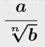
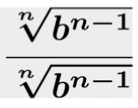
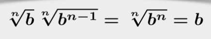

# Week 2

## Function Domain and Range

Given `f(x)`:

- the **domain** can be prescribed or implicit:
  - prescribed: we may want to consider `f(x)` only for `x >= 0`
  - implicit: if not defined, the domain can be assumed to be the largest set for which the function makes sense
- the **range** is the set of values that the function takes

For `f(x) = 1 / |x - 1|` then:

- domain: `ℝ \ {1}`
- range: `]0, +∞[`

## Graph of a function

Let `f(x)`, we denote by `y` the value of `f` to the argument `x` and write `y = f(x)`.

- `x` is the independent variable
- `y` is the dependent variable

The **graph** of the `f` is the set of all points `(x, f(x))` on the cartesian plane.

A function is **affine** when - for parameters `m` and `b` - its definition is `y = f(x) = mx + b`.

- the graph of an affine function is a line
- `m` is called the slope. For positive `m` the line goes up, for negative `m` the line goes down, for `m = 0` the line is flat (constant function)
- `b` is called the "y-intercept" and it marks the point where the line meets the y-axis

## Rationalizing the denominator - 1

Given:  


you can multiply by:  


to take advantage of:  


Example:

```
1 / 3√(7)
= 1 / 3√(7) * 3√(7*7) / 3√(7*7)
= 3√(7*7) / 7
```

## Rationalizing the denominator - 2

Given

```
c / (√a ± √b)
```

then you can multiply by

```
(√a ± √b) / (√a ± √b)
Note: with +/- the opposite of the original
```

to take advantage of

```
(√a - √b) / (√a + √b) = a - b
```

Example

```
4 / (√5 + √3)
= 4 / (√5 + √3) * (√5 - √3) / (√5 - √3)
= 4(√5 - √3) / (5 - 3)
= 4(√5 - √3)  / 2
= 2(√5 - √3)
```
