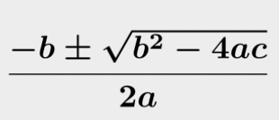
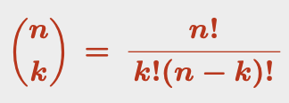

# Week 3

## Root of a function

The values for which `f(x) = 0`

## Quadratic Polynomial - Completing the square

A quadratic polynomial has the form of `ax^2 + bx + c`
The delta is `b^2 - 4ac`

- if `delta < 0` then the quadratic polynomial has 0 no roots
- if `delta ≥ 0` then its roots are given by the **quadratic formula**

### The Quadratic Formula



## The Euclidian Divison Algorithm

Used for diving one polynomial `P(x)` with another `D(x)`, provided that the `degree(D) ≤ degree(P)`.

```
P(x) / D(x) = Q(x) + (R(x) / D(x))

P(x) = D(x) * Q(x) + R(x)
```

where:

- `Q(x)` is the quotient
- `R(x)` is the remainder
- `degree(R) < degree(D)`

## The Rational Root Theorem

Given a polynomial `P(x)` it can be difficult to determine its roots.

**Theorem**: Given a polynomial `P(x)`, with integer coefficients with a non-zero constant term, you can find a possible root between all values `p/q` where `p` divides the constant term and `q` divides the leading coefficient.

Example:
`P(x) = xˆ3 - 2xˆ2 - 10x + 8`

- Constant is `8`
- Leading Coeffient is `1` (from `xˆ3`)
- `p` that divide 8 are ±1 ±2 ±4 ±8
- `q` that divide 1 is ±1
- `p/q` can be ±1 ±2 ±4 ±8

## Binomial Coefficients

`n choose k = n! / (k! * (n - k)!)`


